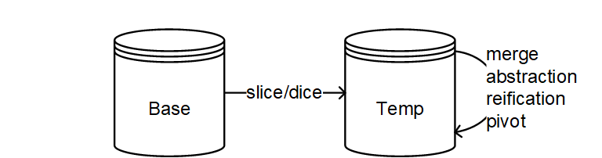

# Knowledge Graph OLAP

A *knowledge graph* (KG) represents real-world entities and their relationships with each other. The thus represented knowledge is often context-dependent, leading to the construction of contextualized KGs. Due to the multidimensional and hierarchical nature of context, the multidimensional OLAP cube model from data analysis is a natural fit for the representation of contextualized KGs. Traditional systems for online analytical processing (OLAP) employ cube models to represent numeric values for further processing using dedicated query operations. 

Knowledge Graph OLAP (KG-OLAP) adapts the OLAP cube model for working with contextualized KGs. In particular, the roll-up operation from traditional OLAP is decomposed into a merge and an abstraction operation. The merge operation corresponds to the selection of knowledge from different contexts whereas abstraction replaces entities with more general entities. The result of such a query is a more abstract, high-level view on the contextualized KG.

The following figure illustrates the difference between (a) traditional OLAP and (b) KG-OLAP. In traditional OLAP, each cell has numeric measures and the cell's dimension attributes characterize a fact of interest. In KG-OLAP, each cell of the OLAP cube comprises an RDF graph and the cell's dimension attributes represent the context which the knowledge is relevant for. As opposed to traditional OLAP systems, where summarization applies an *aggregation* function to a group of numeric values, summarization in KG-OLAP first merges graphs from different contexts and then applies an *abstraction* function to the merged graph. In the example below, entities are replaced by a more abstract grouping (G).

# Implementation
The KG-OLAP system consists of two repositories, namely base and temporary repository. The base repository contains the base data which are periodically updated by extract, transform, and load (ETL) routines. The base repository contains both schema and instance data of a KG-OLAP cube. The temporary repository contains a working copy of (selected partitions of) the KG-OLAP cube from the base repository. Using the slice-and-dice operator, an analyst selects a subset of the data from the base repository to be loaded into the temporary repository for further analysis. Merge, abstract, reification, and pivoting operations are then performed on the temporary repository.

The [RDFpro](https://github.com/dkmfbk/rdfpro) rule inference engine computes context coverage as well as the
materialization of inferences and propagation of knowledge across contexts. The current
implementation, for evaluation purposes, loads the repository into an RDF model in
main memory, performs inferences, and writes the model back into the repository.
RDFpro, however, also supports stream-based computation using the Sesame/RDF4J
RDFHandler interface.

The operations are realized as SPARQL \lstinline{SELECT} statements that return a "delta" table, i.e., a tuple query result where each tuple represents an RDF quad along with the indication of the operation (-, +), which specifies whether the quad must be added to or deleted from the target repository in order to obtain the result. The following extract of a delta table shows an example of a delete and an insert delta tuple, which in that case corresponds to a triple-generating abstraction that replaces runway individuals by the airport individual that the runway is situated at.

`?s` | `?p` | `?o` | `?g` | `?op` 
:-:|:--:|:--:|:--:|:---:
`obj:Runway16/34` | `obj:contaminant` | `obj:cont#265` | `cube:Ctx-1-mod` | `"-"`
`obj:airportLOWW` | `obj:contaminant` | `obj:cont#265` | `cube:Ctx-1-mod` | `"+"`

Due to the SPARQL-based implementation of query operations, off-the-shelf RDF
quad stores may manage base and temporary repositories of a KG-OLAP system. In
theory, any RDF quad store can be used; the current implementation has been tested
using [Ontotext GraphDB](https://www.ontotext.com/products/graphdb/). 

## Installation
The KG-OLAP system employs off-the-shelf quad stores, including in-memory stores. You have to create a base and temporary repository before creating a KG-OLAP cube. We recommend using GraphDB with heap size explicitly set:

    user$ graphdb -Xms100g -Xmx100g 

You can download the KG-OLAP Maven project and run `mvn clean package` in order to compile a binary package. You can also download pre-compiled binary packages of the KG-OLAP software.

**Download binaries** [[ZIP]](../bin/kgolap-1.0.3-bin.zip) [[TAR.GZ]](../bin/kgolap-1.0.3-bin.tar.gz)

## Benchmarks
The KG-OLAP system comes with a benchmarking feature that allows to run performance experiments. When executed in benchmarking mode, the KG-OLAP system produces two log files for each query execution. The first log file captures the timestamps of both the beginning and end of certain operations ("wall time"), e.g., the execution of the SPARQL query calculating the "delta" table. Note that capturing wall time has its drawbacks for microbenchmarking but in this case we think it is acceptable: We are not dealing in the range of milliseconds but several seconds to minutes for large datasets with millions of statements. Benchmarking mode also captures elapsed CPU time before and after operations. The second log file captures general statistics about datasets and query operations, e.g., number of total statements, number of computed delta statements.

The `DemoRunner` class can be used to run performance experiments. We recommend explicitly setting the heap size because in the current implementation, rule evaluation is performed in memory. To run the provided benchmark datasets and analyses, 20 GB of heap space should be enough. Setting the temporary directory is optional. The system properties `at.jku.dke.kgolap.demo.benchmark.dir`, `at.jku.dke.kgolap.demo.benchmark.log`, and `at.jku.dke.kgolap.demo.benchmark.statistics.log` determine the location of the log files. The binaries and third-party libraries must be in the classpath. Command-line arguments allow to specify which dataset, query, and repositories will be used as well as the number of iterations that will be performed, i.e., how often the query will be executed. 

The following Linux command executes the `DemoRunner` class with 20 GB of initial and maximum heap space using `tmpdir` as temporary directory. Logs are written to the `benchmarks` directory into the files `benchmark.log` and `benchmark-statistics.log`. The contents of the `bin` and `lib` directories are included in the classpath. The `-s` argument specifies that the used dataset has three dimensions, a *small* context size and a *large* statement size (number of facts/statements). The `-fb` argument specifies that the KG-OLAP cube should connect to the base repository via HTTP and Sesame/RDF4J whereas the `-ub` argument specifies the URL of the SPARQL endpoint. Analagously, the `-ft` and `-ut` arguments specify how to connect to the temporary repository. The `-a` argument specifies the query/analysis that is conducted and `-i` specifies the number of times the analysis is conducted.
    
    java -Xms20g -Xmx20g 
         -Djava.io.tmpdir=tmpdir 
         -Dat.jku.dke.kgolap.demo.benchmark.dir=benchmarks 
         -Dat.jku.dke.kgolap.demo.benchmark.log=benchmarks/benchmark.log
         -Dat.jku.dke.kgolap.demo.benchmark.statistics.log=benchmarks/benchmark-statistics.log 
         -cp bin/*:lib/* 
         at.jku.dke.kgolap.demo.DemoRunner 
         -s at.jku.dke.kgolap.demo.datasets.DemoDataset3DSmallContextLargeFact  
         -fb at.jku.dke.kgolap.repo.sesame.SesameHTTPRepoFactory 
         -ub http://localhost:7200/repositories/Base 
         -ft at.jku.dke.kgolap.repo.sesame.SesameHTTPRepoFactory 
         -ut http://localhost:7200/repositories/Temp 
         -a at.jku.dke.kgolap.demo.analyses.DemoAnalysis3DSliceDice 
         -i 15 

A number of predefined (procedurally generated) datasets and corresponding benchmark queries demonstrate the KG-OLAP system. Note that while the number of contexts and statements in the generated data sets remain stable, the randomly generated identifiers and literals differ across instantiations. There are also minor discrepancies in the number of total resources.

Using the predefined datasets and queries, we ran performance experiments on a virtual CentOS 6.8 machine with four cores of an Intel Xeon CPU E5-2640 v4 with 2.4 GHz, hosting a GraphDB 8.9 instance. The Java Virtual Machine(JVM) of the GraphDB instance ran with 100 GB heap space. The JVM of the KG-OLAP cube, which conducts rule evaluation and caches query results, ran with 20 GB heap space.

The GraphDB instance comprised two repositories -- base and temporary -- with the following configuration; please refer to the [GraphDB manual](http://graphdb.ontotext.com/documentation/8.9/free/configuring-a-repository.html "Configuring a repository") for further information. The entity index size was 30 000 000 and the entity identifier size was 32 bits. Context index, predicate list, and literal index were enabled. Reasoning and inconsistency checkswere disabled; the KG-OLAP implementation takes care of reasoning via RDFpro rule evaluation.

    @prefix rdfs: <http://www.w3.org/2000/01/rdf-schema#>.
    @prefix rep: <http://www.openrdf.org/config/repository#>.
    @prefix sr: <http://www.openrdf.org/config/repository/sail#>.
    @prefix sail: <http://www.openrdf.org/config/sail#>.
    @prefix owlim: <http://www.ontotext.com/trree/owlim#>.
    
    [] a rep:Repository ;
        rep:repositoryID "Base | Temp" ;
        rdfs:label "" ;
        rep:repositoryImpl [
            rep:repositoryType "graphdb:FreeSailRepository" ;
            sr:sailImpl [
                sail:sailType "graphdb:FreeSail" ;
            
                owlim:base-URL "http://dkm.fbk.eu/ckr/meta#" ;
                owlim:defaultNS "" ;
                owlim:entity-index-size "30000000" ;
                owlim:entity-id-size  "32" ;
                owlim:imports "" ;
                owlim:repository-type "file-repository" ;
                owlim:ruleset "empty" ;
                owlim:storage-folder "storage" ;
 
                owlim:enable-context-index "true" ;
  
                owlim:enablePredicateList "true" ;

                owlim:in-memory-literal-properties "true" ;
                owlim:enable-literal-index "true" ;
    
                owlim:check-for-inconsistencies "false" ;
                owlim:disable-sameAs  "true" ;
                owlim:query-timeout  "0" ;
                owlim:query-limit-results  "0" ;
                owlim:throw-QueryEvaluationException-on-timeout "false" ;
                owlim:read-only "false" ;
            ]
        ].
        
The GitHub repository contains log files from our performance experiments as a reference benchmark in the `benchmarks` directory. Note that we provide the uncleaned log files: In some cases, the first benchmark runs produced exceptional results which were probably down to a slowdown in the GraphDB instance after multiple runs. Subsequent results showed the expected behavior. We exclude the exceptional results from statistical evaluation but keep them in the log for transparency's sake. You will find the R scripts used for evaluating the log files in the `benchmarks/r` directory on the GitHub repository, which also perform rudimentary data cleaning tasks.

We also provide the generated datasets and resulting delta tables from our performance experiments as downloads:

- Slice/Dice ([3D](https://final.at/kg-olap/benchmarks-3D-slicedice.tar.gz)/[4D](https://final.at/kg-olap/benchmarks-4D-slicedice.tar.gz))
- Merge Union ([3D](https://final.at/kg-olap/benchmarks-3D-merge.tar.gz)/[4D](https://final.at/kg-olap/benchmarks-4D-merge.tar.gz))
- [Triple-Generating Abstraction](https://final.at/kg-olap/benchmarks-abstraction-triplegenerating.tar.gz)
- [Individual-Generating Abstraction](https://final.at/kg-olap/benchmarks-abstraction-individualgenerating.tar.gz)
- [Value-Generating Abstraction](https://final.at/kg-olap/benchmarks-abstraction-valuegenerating.tar.gz)
- [Reification](https://final.at/kg-olap/benchmarks-reification.tar.gz)
- [Pivot](https://final.at/kg-olap/benchmarks-pivot.tar.gz)
